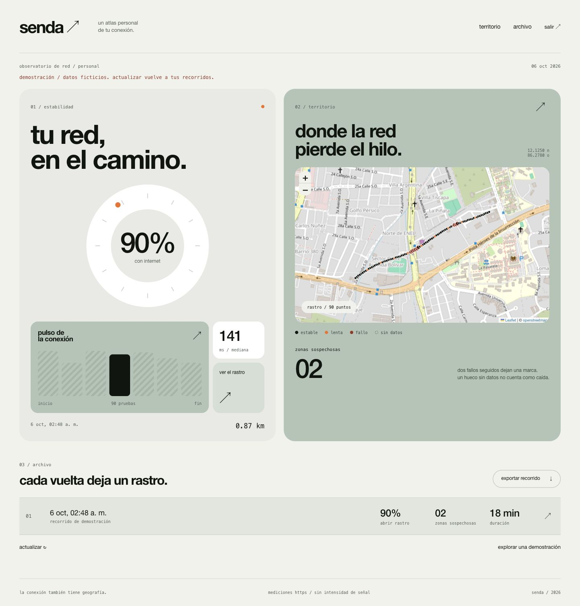

# senda

registro de conectividad por ubicación para iphone, con un mapa web privado. interfaz inspirada en la referencia: salvia, blanco, tinta negra, indicador circular y barras rayadas.



## iphone

abre `ios/Senda.xcodeproj` en xcode, selecciona tu equipo de firma y ejecuta en tu iphone con ios 26 o posterior. el proyecto incluye `ios/project.yml` para regenerarlo con `xcodegen generate`.

inicia un recorrido y concede ubicación mientras se usa la app. aparece el indicador de ubicación en segundo plano. se registran posición, precisión, interfaz, tiempo de respuesta https y resultado. los recorridos se guardan localmente mediante escritura atómica; al terminar, al recuperar una ruta de red o al abrir la app se intenta sincronizar si configuraste el servidor. también puedes sincronizar manualmente y exportar json.

las pruebas intentan ejecutarse cada 12 segundos, con dos destinos independientes: cloudflare y apple. más de 800 ms se marca lento; dos fallos consecutivos separados por no más de 45 segundos forman una zona sospechosa. los intervalos más largos se interrumpen en el mapa y no se cuentan como caídas. solo se aceptan ubicaciones de menos de 20 segundos y precisión de hasta 100 metros. máximo de 10 000 puntos por recorrido.

ios puede suspender la ejecución. esto mide disponibilidad y tiempo de respuesta, no potencia de señal ni pérdida de paquetes icmp. las caídas de ambos destinos también podrían deberse a restricciones de la red. validar el muestreo con el iphone bloqueado requiere un recorrido físico.

el argumento de lanzamiento `--demo` muestra una ruta ficticia, sin leer ni escribir tu historial, grabar o sincronizar sus datos. no está activado por defecto.

## servidor y web

php 8.3 o posterior, composer, node y npm. laravel 13, sqlite por defecto; también puedes configurar mysql en `.env`.

```sh
cd server
composer install
cp .env.example .env
php artisan key:generate
touch database/database.sqlite
php artisan migrate
php artisan senda:token
npm ci
npm run build
php artisan serve --host=127.0.0.1 --port=8731
```

en esta copia de desarrollo las dependencias y la base ya están preparadas. el token local está en `.local-token`, excluido de git. el comando `senda:token` rota el token y cierra el acceso de las sesiones anteriores; guarda el nuevo token antes de cerrar la terminal.

entra a la web con ese token. en el iphone, configura la dirección **https** del servidor y el mismo token; el token se guarda en keychain. el servidor recibe únicamente recorridos terminados. repetir la subida es seguro y no duplica muestras; un contenido diferente con el mismo identificador se rechaza.

el botón «explorar una demostración» de la web no escribe datos en la base. «actualizar» vuelve a los recorridos reales.

## publicar

el proyecto está listo para un alojamiento php; todavía no está publicado en internet. sirve únicamente `server/public`, configura un dominio con https, `APP_ENV=production`, `APP_DEBUG=false`, `APP_URL=https://tu-dominio`, `SESSION_SECURE_COOKIE=true` y la base de datos. después ejecuta migraciones y `php artisan config:cache`. mantén `.env`, la base, backups y el token fuera del directorio público. el mapa usa calles de openstreetmap y requiere internet para cargarlas.

## verificación

```sh
cd ios
swift test
xcodebuild -project Senda.xcodeproj -scheme Senda -destination 'generic/platform=iOS' CODE_SIGNING_ALLOWED=NO build
cd ../server
php artisan test
npm run build
```

4 pruebas de métricas y 8 pruebas de servidor. compilación de iphone sin firma comprobada. revisión web a 390 y 1440 píxeles, con mapa, estados vacíos, datos ficticios y exportación. pendiente: ubicación y mediciones en segundo plano en el iphone físico.
